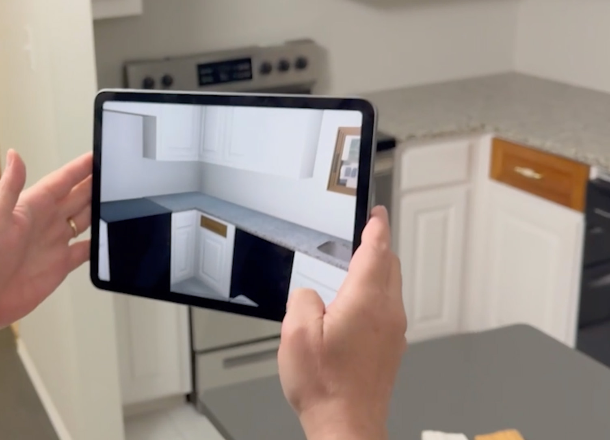
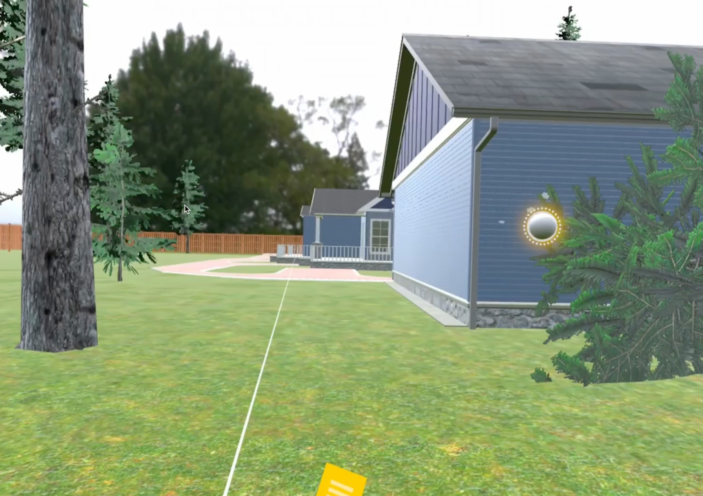
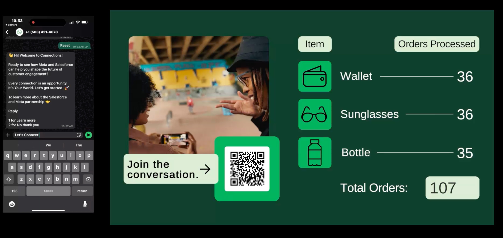
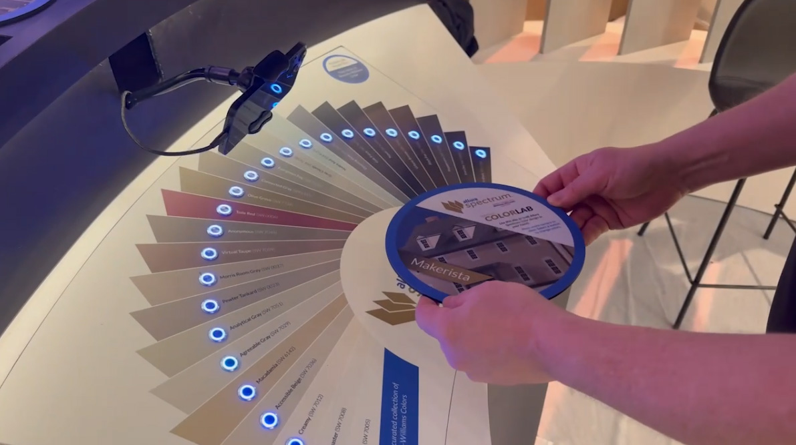
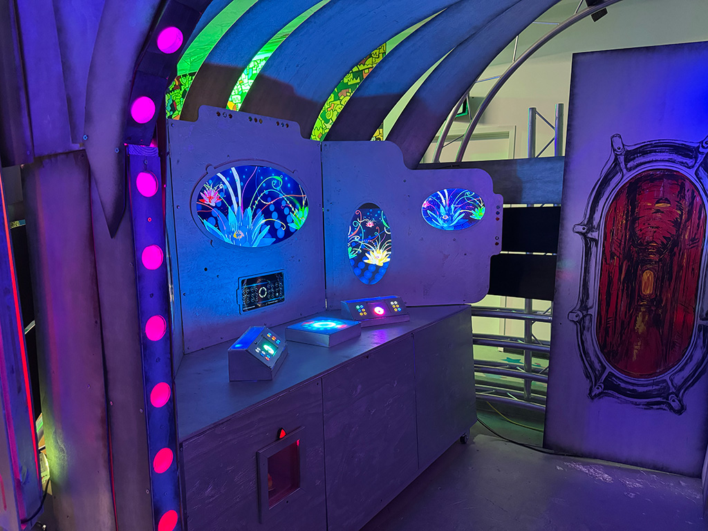
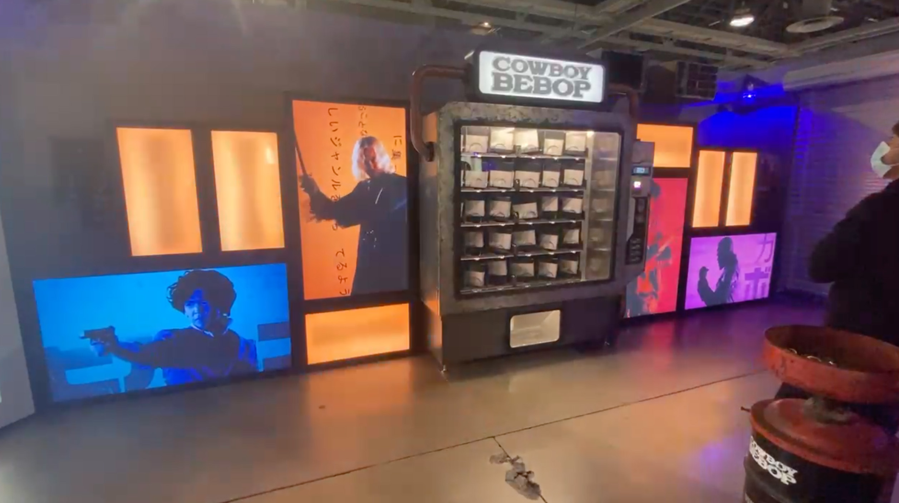
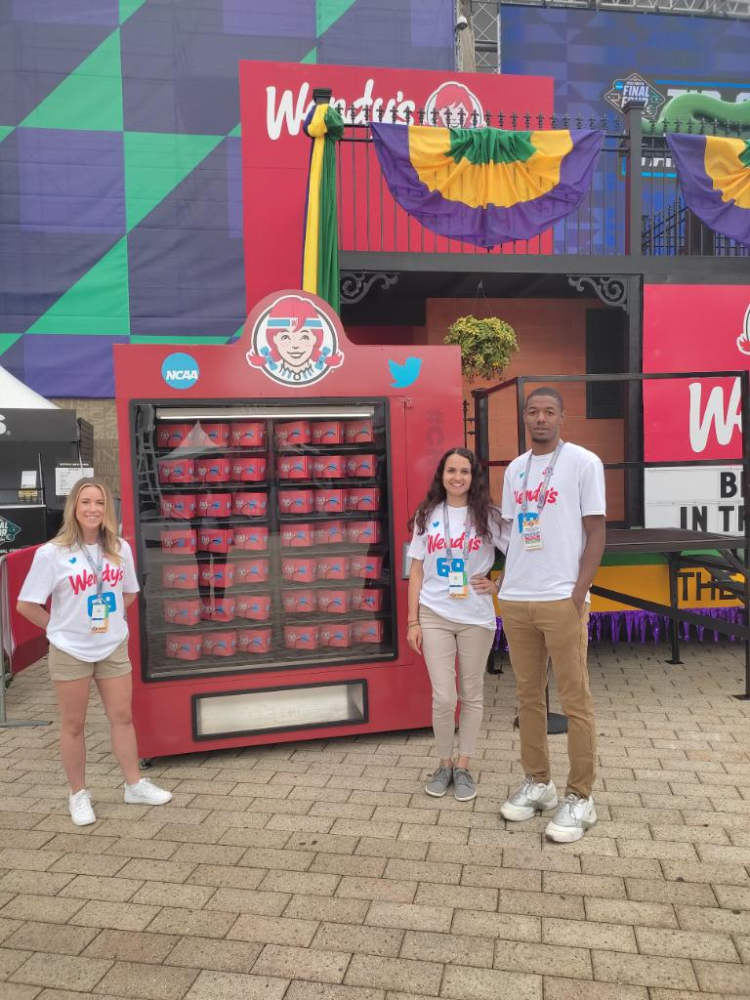
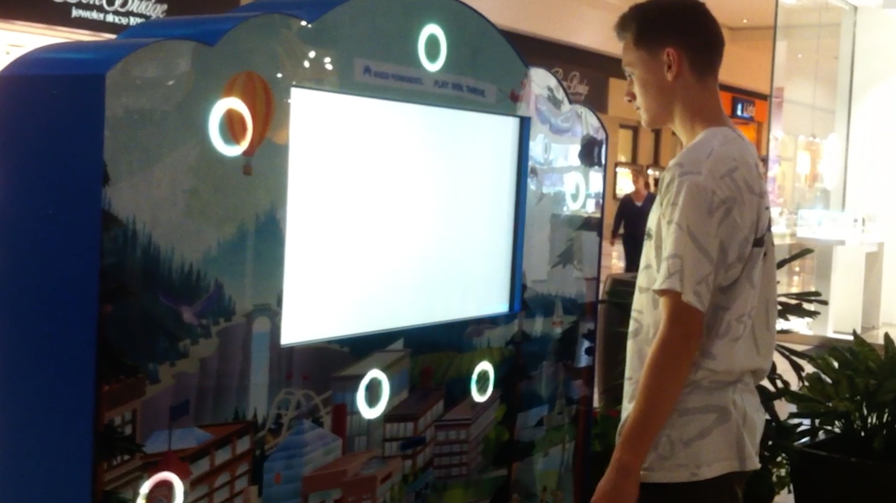

# Project Archive

This archive documents selected interactive systems, installations, and platforms developed over the past several years.

Projects emphasize the integration of software, hardware, and cloud infrastructure across environments such as corporate headquarters, trade shows, public installations, and training platforms.

## Systems Included

- AR Training
- VR Training
- Meta Trade Show WhatsApp Demo
- Allura AR Paint Visualization
- Fathom Immersive Installation
- Netflix Cowboy Bebop Installation
- Wendy’s / Twitter Social Vending
- Google Corporate Timeline
- Kaiser Permanente Health Quiz Kiosk

---

<strong>AR Training System</strong>

 

**System Snapshot**

| Category | Augmented Reality Training |
|----------|---------------------------|
| Engine | Unity |
| Languages | C#, Next.js |
| Cloud | Firebase |
| Tools | Blender |
| Platform | iPad |

Development of an augmented reality training application for insurance adjusters.  
3D replicas of residential environments were created in Blender and aligned with real-world spaces so that virtual damage scenarios could be explored through an iPad. The system enabled learners to inspect simulated flood damage behind appliances and structural components. Usage data was transmitted to Firebase and visualized through a Next.js dashboard for training analytics.

---

<strong>VR Training</strong>

 

**System Snapshot**

| Category | Virtual Reality Training |
|----------|-------------------------|
| Engine | Unity |
| Languages | C# |
| Platform | Meta VR Headsets |
| Tools | Blender |

Development of immersive VR simulations of residential environments used for insurance training.  
Users explored virtual properties to identify structural and environmental damage that may or may not be covered by insurance policies. The simulations provided a controlled environment for practicing property assessment scenarios.

---

<strong>Meta Trade Show WhatsApp Demonstration</strong>

 

**System Snapshot**

| Category | Interactive Trade Show Demo |
|----------|-----------------------------|
| Engine | Unity |
| Languages | Node.js, C#, Next.js |
| Platforms | Twilio, Railway |
| Cloud | Firebase |

Design and deployment of an interactive WhatsApp demonstration used at Meta trade shows.  
Visitors launched the experience by scanning a QR code that initiated a WhatsApp workflow simulating business use cases and swag selection. Interaction data was stored in Firestore and visualized in real time on a Unity-powered display wall. Post-event analytics were accessible through a Next.js dashboard.

---

<strong>Allura Augmented Reality Paint Visualization</strong>

 

**System Snapshot**

| Category | Augmented Reality Installation |
|----------|-------------------------------|
| Engine | Unity |
| Languages | C#, Arduino |
| Cloud | Firebase |
| Hardware | Arduino Button Console |
| Tools | Blender |

Development of an AR visualization system used at trade shows to demonstrate siding and paint options for residential buildings.  
Users placed printed building cards beneath a mobile device running a Unity AR application, generating animated 3D models of each structure. A physical console of 20 Arduino-controlled buttons allowed real-time paint color selection, synchronized through Firebase.

---

<strong>Fathom Submarine Bridge Installation</strong>

 

**System Snapshot**

| Category | Immersive Public Art Installation |
|----------|-----------------------------------|
| Engine | Unity |
| Languages | C#, Arduino |
| Platforms | Firebase, ESP8266 |
| Displays | 6 LCD Screens |
| Inputs | 24 Physical Buttons |

Development of an interactive submarine bridge environment within the **Fathom** immersive art installation in Portland.  
A console of 24 physical buttons controlled synchronized video across six displays while all interactions were recorded in Firebase. Remote ESP8266 boards monitored cloud updates to trigger environmental lighting effects. The installation recorded more than 250,000 user interactions during its two-year run.

---

<strong>Netflix Cowboy Bebop Trade Show Installation</strong>

 

**System Snapshot**

| Category | Interactive Trade Show Installation |
|----------|-------------------------------------|
| Engine | Unity |
| Languages | C#, Arduino |
| Displays | 4 LCD Screens |
| Lighting | LED Walls |
| Hardware | Custom Vending Machine |

Development of an interactive promotional installation for the launch of Netflix’s *Cowboy Bebop*.  
Visitors inserted a coin into a custom vending machine that triggered synchronized visual sequences and LED lighting effects coordinated through Unity and Arduino. The interaction concluded with the dispensing of promotional prizes.

---

<strong>Wendy’s / Twitter Social Vending Installation</strong>

 

**System Snapshot**

| Category | Interactive Marketing Installation |
|----------|-----------------------------------|
| Engine | Unity |
| Languages | C#, Arduino |
| Input | Twitter Hashtag System |
| Hardware | Custom Vending Machine |

Implementation of a social media-driven promotional installation developed with Wendy’s and Twitter.  
Users posted a specific hashtag to receive a code which was entered into a Unity touchscreen interface. The system communicated with an Arduino controller to activate a vending machine that dispensed promotional items.

---

<strong>Google Corporate Timeline Installation</strong>

 

  

  

**System Snapshot**

| Category | Corporate Interactive Installation |
|----------|-----------------------------------|
| Environment | Google Corporate HQ |
| Displays | 16 Touchscreens |
| Compute | 8 PCs |
| Engine | Unity |
| CMS | Angular |
| Synchronization | Firebase |
| Languages | C# |

Design and deployment of a large-scale interactive timeline installation located in Google headquarters.  
Sixteen touchscreen displays present historical milestones and media across synchronized Unity applications running on eight PCs. Firebase maintains synchronization between systems while an Angular-based CMS manages the installation’s content.

---

<strong>Kaiser Permanente Health Quiz Kiosk</strong>

 

**System Snapshot**

| Category | Interactive Retail Kiosk |
|----------|-------------------------|
| Engine | Unity |
| Languages | C#, Arduino |
| Hardware | Custom PCB Controller |
| Inputs | 8 Physical Buttons |
| Output | Coupon Printer |

Development of an interactive health quiz kiosk deployed in a retail mall environment.  
Users interacted with a Unity touchscreen quiz and completed physical button-sequence challenges triggered by incorrect answers. A custom Arduino-based PCB controlled button lighting and input detection while communicating with the Unity application. Upon completion, the kiosk printed promotional health coupons.

