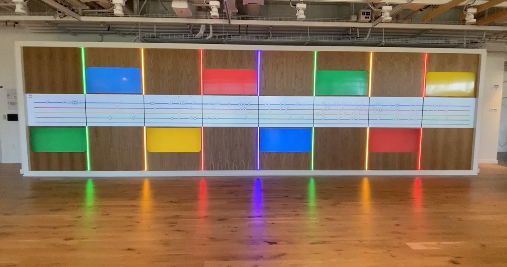

  

<h1 align="center">Fred Knack</h1>

Creative technologist building interactive systems with <b>Unity, web platforms, and embedded hardware</b>.

Developer of <a href="https://siggme.com"><b>Siggme.com</b></a>

Interactive installations, real-time systems, and social platforms used in corporate environments and live experiences.

  <a href="#featured-systems"><b>Featured Systems</b></a> •
  <a href="#technologies"><b>Technologies</b></a> •
  <a href="#interactive-technology"><b>Interactive Technology</b></a> •
  <a href="#current-focus"><b>Current Focus</b></a>

 

Siggme is a platform designed to help people organize real-world gatherings through **clear social signals** — allowing hosts to gather interest before committing to dates or logistics.

 

---

## Featured Systems

### ⭐ Google Corporate Timeline Installation

  

Interactive timeline installation located in **Google headquarters**.

The system runs across **16 synchronized touchscreen displays powered by 8 PCs**, each controlling two displays. Each Unity PC drives two displays while Firebase synchronizes timeline state and user interactions across the entire installation. The experience was built in **Unity** with **Firebase-based synchronization** to keep all screens coordinated in real time.

**Tech:** Unity • C# • Firebase • Multi-display synchronization

 

<table>
  <tr>
    <td valign="top" width="50%">

### Siggme — Social Coordination Platform

Platform for organizing real-world gatherings through signal-based coordination.

Users propose activities, gather interest from subscribers, and schedule events once enough people commit.

**Tech:** JavaScript • Web Platform • Cloud Services

  </td>
    <td valign="top" width="50%">

### Meta Trade Show WhatsApp Demonstration

Interactive trade show experience used by **Meta** to demonstrate WhatsApp integrations.

The system uses **Node.js services connected to Firebase**, combined with **Unity visualization displays** that show live WhatsApp usage activity during demonstrations.

**Tech:** WhatsApp • Node.js • Firebase • Unity • Real-time messaging systems

  </td>
  </tr>
</table>

 
---

**[View Full Project Archive →](ProjectArchive.md)**

 
---

## Technologies

 

---

## Interactive Technology

Many of my projects combine software and hardware to create **interactive environments used in exhibits, corporate spaces, and live experiences**.

Typical components include:

- Unity-driven applications  
- sensors and microcontrollers  
- LED systems and physical interfaces  
- Raspberry Pi and embedded devices  
- real-time cloud services  

 

---

## Current Focus

- Building **Siggme.com**  
- Interactive installations using Unity and sensors  
- Real-time hardware + cloud systems  

---
