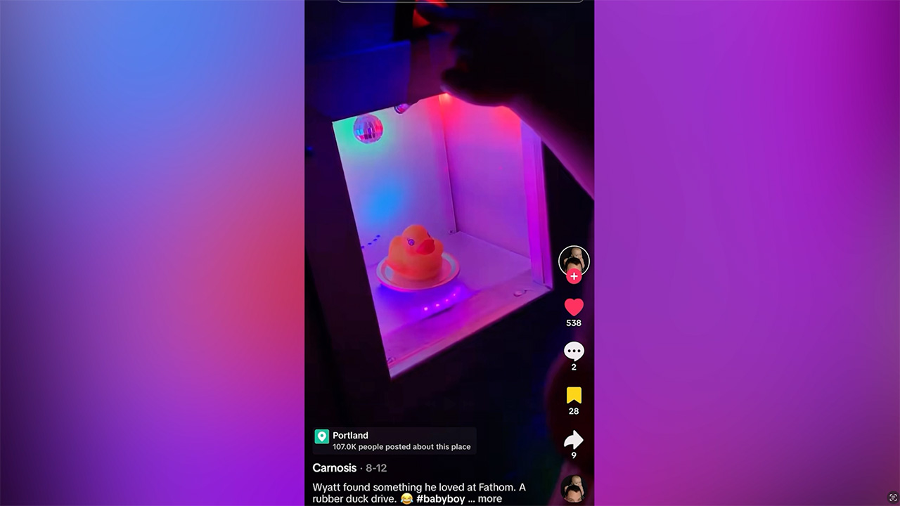
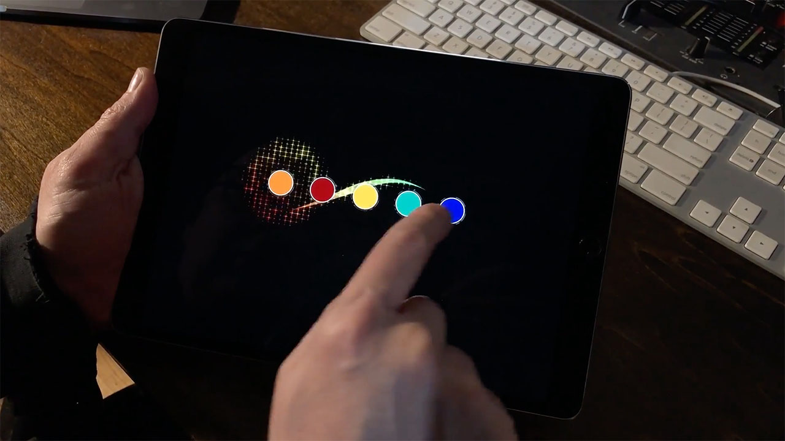
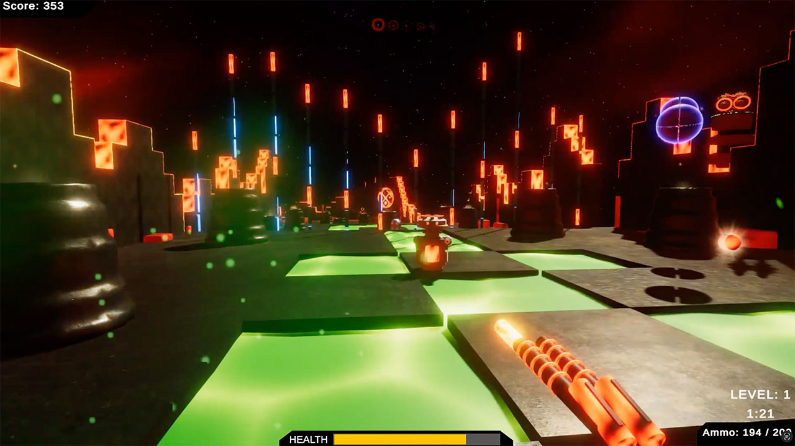

  

<h1 align="center">Research & Experiments</h1>

Prototype systems, interaction experiments, and playful installations.

---

A collection of prototype systems, technical experiments, and mini installations
built to explore new interaction techniques, hardware integrations, and
real-time rendering ideas.

Many of these experiments later evolve into larger installations.

Many techniques used in production installations originate from experiments in this archive.

---

<h2 align="center">Selected Experiments</h2>

  
  

  
  

<strong>The World's First Duck Warp Drive</strong>

 

  

  

**System Snapshot**

| Category | Immersive Art |
|----------|----------------|
| Engine | Arduino |
| Platforms | Arduino, ESP8266 |
| Tools | Servos, Arduino, LED Lights, Lasers, Disco Balls |

This duck drive was built into my installation at Portland's immersive art exhibit, Fathom.  
When engaged, the submarine sequence accelerated dramatically, creating a playful “warp drive” moment for visitors.  
It was set at a very low level so that it would bring the most joy to children.  
The duck drive was engaged more than 35,000 times during the year and a half that it existed. I know this because every button press in the entire submarine was logged to Firebase Firestore.

---

<strong>Unity Touchscreen Art Tool</strong>

 

  

  

**System Snapshot**

| Category | Touchscreen Art Tool |
|----------|----------------------|
| Engine | Unity |
| Languages | C# |
| Platforms | iOS, Desktop |
| Tools | Unity |

I was trying to find an interesting way to show off the capabilities of multi-touch displays, so I created this Unity tool for artistic expression.

---

<strong>Unity iOS Portfolio</strong>

 

  

  

**System Snapshot**

| Category | Interactive Portfolio |
|----------|------------------------|
| Engine | Unity |
| Languages | C# |
| Platforms | iOS, Desktop |
| Tools | Unity, Adobe Creative Cloud |

In a previous life I was a video editor and motion graphics designer for large corporate events.  
I developed this Unity application so that I could deliver in-person pitches of my work.  
It is abstract, but it fit the need.

---

<strong>Unity First-Person Shooter Prototype</strong>

 

  

  

**System Snapshot**

| Category | Prototype Game |
|----------|----------------|
| Engine | Unity |
| Languages | C#, Node.js |
| Platforms | Desktop |
| Tools | Blender, Substance 3D |

This project began as a pandemic experiment and an opportunity to explore the full pipeline of building a small 3D game in Unity.

All 3D modeling was created in Blender and materials were authored in Adobe Substance 3D.  
A lightweight Node.js backend was developed to store and retrieve player scores for a persistent leaderboard.

